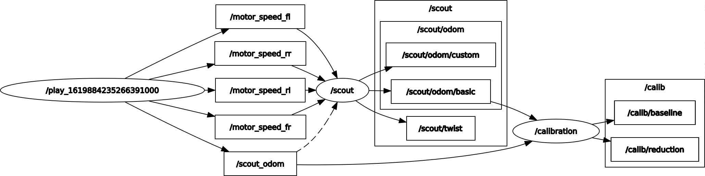

# Robotics-Project

Made by Massimiliano Roccamena

## Introduction

The aim of the project is to build an odometry computing system of a 4-wheels skid steering robot (Agilex Scout) using ROS middleware.

Gearbox reduction and robot baseline parameters must be calibrated, basing on the ground truth odometry provided by the robot manufacturer.

## The system

The nodes of the system are:

- robot (named scout)
- calibration

The entire system can be launched by running

```bash
roslaunch project1 robot_calibration.launch
```

System architecture can be visualized in the following RQT graph



Required topics are:

- /scout/twist
- /scout/odom/basic

(TODO)

## Robot

The node can be launched by running

```bash
roslaunch project1 robot.launch
```

## Calibration

The node can be launched by running

```bash
roslaunch project1 .launch
```
