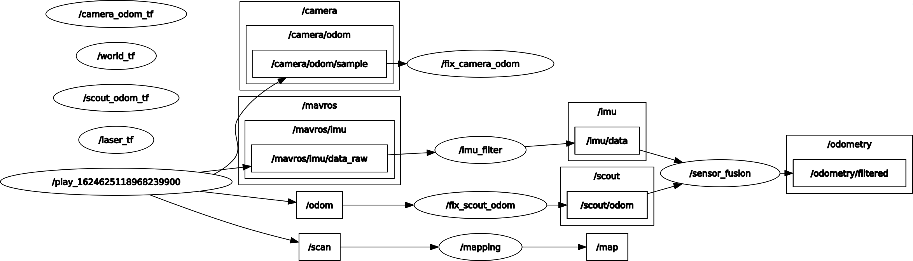
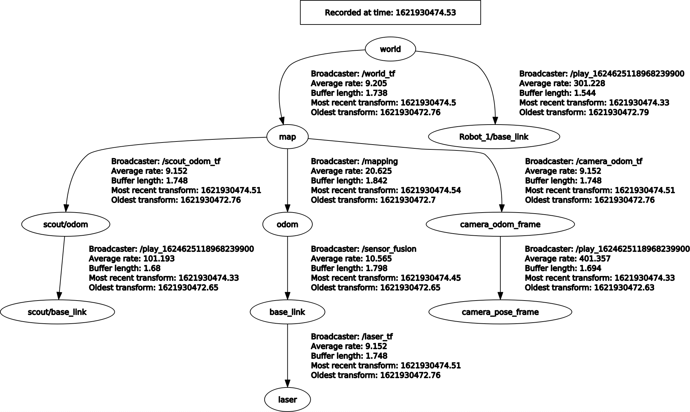
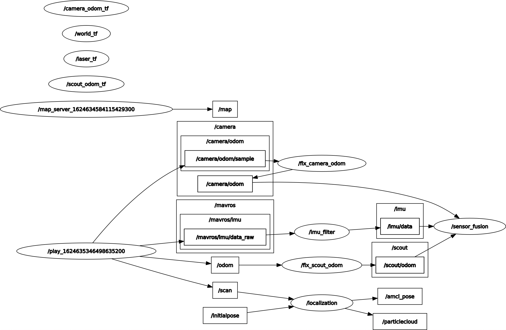
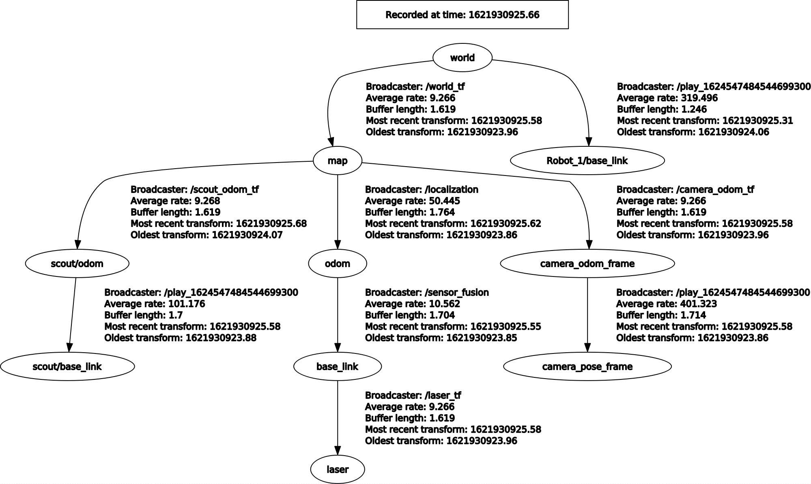

# Robotics-Project

Name: Massimiliano Roccamena

Person Code: 10499005

## Introduction

The objective of the project is to build a mapping system and a localization system for a 4-wheels skid steering robot (Agilex Scout) using ROS middleware.

## Overview

The basic components of the system are:

- fix
- imu_filter
- sensor_fusion
- filtering
- mapping
- localization

Mapping system can be launched by running:

```bash
roslaunch project1 scout_mapping.launch
```

Here are plotted the RQT graph and TF tee:




Localization system can be launched by running

```bash
roslaunch project1 scout_localization.launch
```

Here are plotted the RQT graph and TF tee:




## fix

## imu_filter

## sensor_fusion

## filtering

## mapping

## localization
